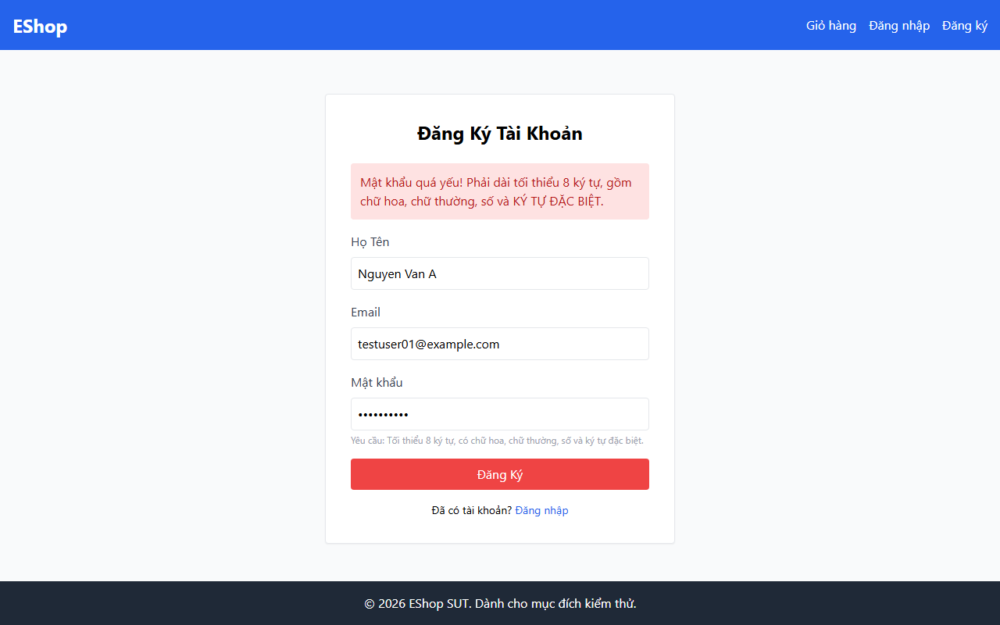

# BUG-001 — Valid Password Rejected on Registration

**Bug ID:** BUG-001  
**Date:** 2026-07-07  
**Feature:** FR-01 — Account Registration  
**Related TC:** TC001  
**Severity:** 🔴 Critical  
**Status:** Open

---

## Title

Registration fails for a valid password — `Password1!` is wrongly rejected as "too weak"

---

## Environment

| Item | Value |
|------|-------|
| Frontend URL | http://localhost:5173/register |
| Backend URL | http://localhost:3000 |
| Browser | Chromium (Playwright headless) |
| Date | 2026-07-07 |

---

## Preconditions

- User is a Guest (not authenticated)
- User has navigated to `/register`
- No account with email `testuser01@example.com` exists

---

## Steps to Reproduce

1. Navigate to `http://localhost:5173/register`
2. Enter **Họ Tên:** `Nguyen Van A`
3. Enter **Email:** `testuser01@example.com`
4. Enter **Mật khẩu:** `Password1!`
5. Click **Đăng Ký**

---

## Expected Result

Registration succeeds. API returns:
```json
{ "message": "User registered successfully", "id": <n> }
```
UI shows a success indication and/or redirects the user.

---

## Actual Result

The form stays on the registration page and displays the error banner:

> **"Mật khẩu quá yếu! Phải dài tối thiểu 8 ký tự, gồm chữ hoa, chữ thường, số và KÝ TỰ ĐẶC BIỆT."**

The API was never called. Registration is completely blocked.

**Analysis:** `Password1!` satisfies all stated rules:
- ✅ Length ≥ 8 (10 characters)
- ✅ Uppercase: `P`
- ✅ Lowercase: `assword`
- ✅ Digit: `1`
- ✅ Special character: `!`

The client-side password strength validator appears to have a defective regex or logic that incorrectly classifies `!` as not a valid special character, or has another logic error.

---

## Impact

This is a **Critical** bug because it completely blocks new user registration — the core function of the feature. No user can successfully register via the UI.

---

## Screenshot Evidence

**Before submit:**  


**After submit (bug visible):**  


---

## GitHub Issue Draft

```markdown
**Title:** [BUG] Registration fails — valid password `Password1!` wrongly rejected as too weak

**Labels:** bug, critical, FR-01

**Description:**
When a user attempts to register with a password that meets all stated requirements
(`Password1!` — 10 chars, uppercase, lowercase, digit, special character), the form
displays the error "Mật khẩu quá yếu!" and does not submit to the API.

**Steps to Reproduce:**
1. Go to /register
2. Fill: name=`Nguyen Van A`, email=`testuser01@example.com`, password=`Password1!`
3. Click Đăng Ký

**Expected:** Registration succeeds (HTTP 200)
**Actual:** Error "Mật khẩu quá yếu!" shown; API never called

**Severity:** Critical — blocks all registrations
```
