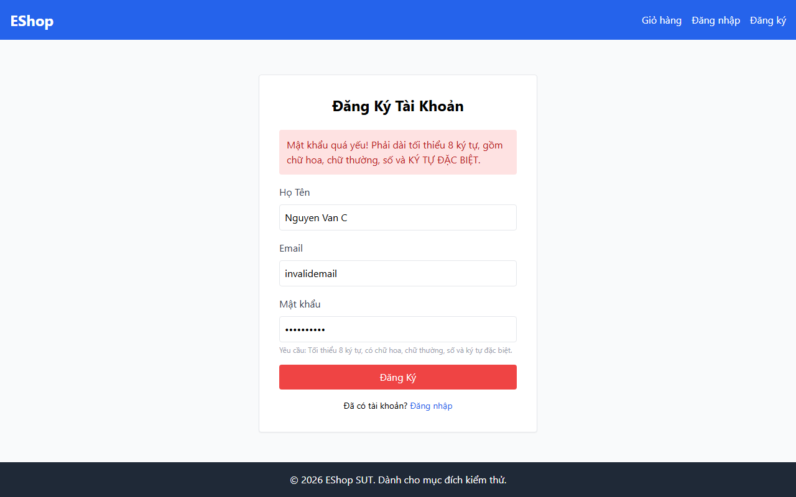
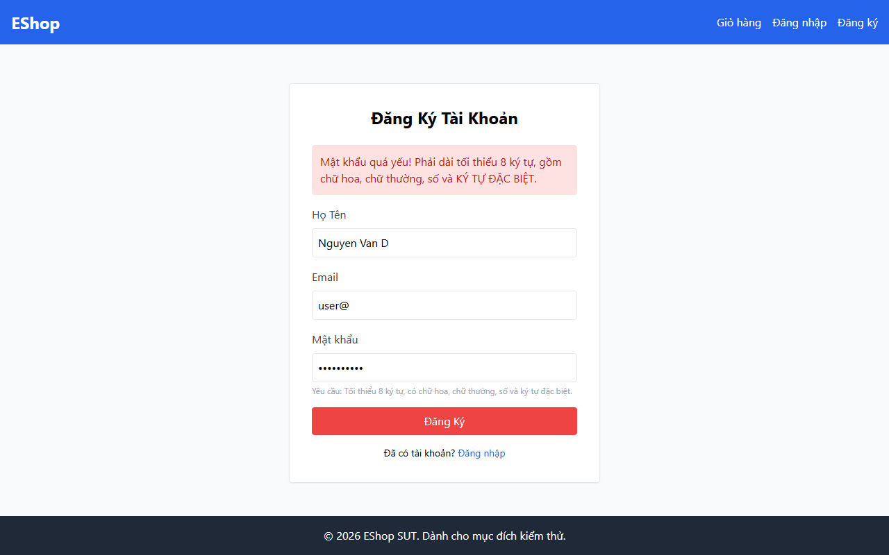

# BUG-002 — No Email Format Validation on Registration Form

**Bug ID:** BUG-002  
**Date:** 2026-07-07  
**Feature:** FR-01 — Account Registration  
**Related TCs:** TC004, TC005, TC006  
**Severity:** 🟠 High  
**Status:** Open

---

## Title

Registration form accepts invalid email formats — no client-side or server-side email validation

---

## Environment

| Item | Value |
|------|-------|
| Frontend URL | http://localhost:5173/register |
| Backend URL | http://localhost:3000 |
| Browser | Chromium (Playwright headless) |
| Date | 2026-07-07 |

---

## Preconditions

- User is a Guest (not authenticated)
- User has navigated to `/register`

---

## Steps to Reproduce (TC004 — missing `@`)

1. Navigate to `http://localhost:5173/register`
2. Enter **Họ Tên:** `Nguyen Van C`
3. Enter **Email:** `invalidemail` *(no `@` symbol)*
4. Enter **Mật khẩu:** `Password1!`
5. Click **Đăng Ký**

**Observed:** Form shows error *"Mật khẩu quá yếu!"* — the email value is not validated.

**Also reproduced with:**
- `user@` (missing domain) — TC005
- `@example.com` (missing local part) — TC006

---

## Expected Result

The form should reject all three invalid email formats and display an error message indicating the email is invalid (e.g., *"Email không hợp lệ"*).

---

## Actual Result

The email field accepts any string. The form proceeds to password validation. Since the password (`Password1!`) is also rejected due to BUG-001, the error displayed is *"Mật khẩu quá yếu!"* — **masking the email validation failure**.

**Root cause observation:** The email input field uses `type="text"` (not `type="email"`), so the browser provides no native format validation. There is no custom client-side email regex validation either.

---

## Impact

Users can submit malformed email addresses. This may result in:
- Accounts being registered with unusable email addresses
- Inability to send confirmation/reset emails
- Data quality issues in the user database

---

## Screenshot Evidence

**TC004 — email `invalidemail` (no `@`):**  


**TC005 — email `user@` (no domain):**  


**TC006 — email `@example.com` (no local part):**  


---

## GitHub Issue Draft

```markdown
**Title:** [BUG] No email format validation — invalid emails accepted on registration form

**Labels:** bug, high, FR-01

**Description:**
The registration form at /register does not validate the email field format.
Strings like `invalidemail`, `user@`, and `@example.com` are all accepted
without any error message specific to email format.

The email input uses `type="text"` instead of `type="email"`, bypassing
native browser email validation. No custom JS validation is present either.

**Steps to Reproduce:**
1. Go to /register
2. Fill: name=`Nguyen Van C`, email=`invalidemail`, password=`Password1!`
3. Click Đăng Ký

**Expected:** Error "Email không hợp lệ" (or similar)
**Actual:** Email accepted; password error shown instead (masked by BUG-001)

**Also reproduces with:** `user@`, `@example.com`

**Severity:** High
```
