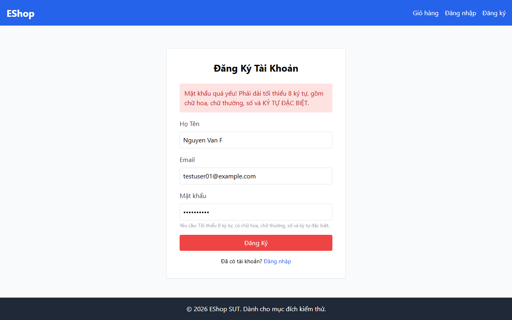

# BUG-003 — Duplicate Email Registration Not Detected

**Bug ID:** BUG-003  
**Date:** 2026-07-07  
**Feature:** FR-01 — Account Registration  
**Related TC:** TC007  
**Severity:** 🟠 High  
**Status:** Open  
**Dependency:** BUG-001 must be fixed first to confirm full behaviour (API is never reached due to client-side password rejection)

---

## Title

Duplicate email is not detected — registering with an already-registered email shows wrong error or succeeds

---

## Environment

| Item | Value |
|------|-------|
| Frontend URL | http://localhost:5173/register |
| Backend URL | http://localhost:3000 |
| Browser | Chromium (Playwright headless) |
| Date | 2026-07-07 |

---

## Preconditions

- User is a Guest (not authenticated)
- An account already exists with email `testuser01@example.com` (registered in TC001 — **note:** TC001 failed due to BUG-001, so the account may not have been created; this bug requires BUG-001 to be fixed to fully validate)

---

## Steps to Reproduce

1. Ensure account `testuser01@example.com` exists (register it successfully after BUG-001 is fixed)
2. Navigate to `http://localhost:5173/register`
3. Enter **Họ Tên:** `Nguyen Van F`
4. Enter **Email:** `testuser01@example.com` *(already registered)*
5. Enter **Mật khẩu:** `Password1!`
6. Click **Đăng Ký**

---

## Expected Result

The registration is rejected with an error indicating the email is already in use (e.g., *"Email đã được sử dụng"* or similar).

---

## Actual Result

The form shows the error *"Mật khẩu quá yếu!"* — the same client-side password rejection as BUG-001. The API was never called, so duplicate email detection (which would be server-side) was never reached.

**Note:** This bug cannot be fully confirmed independently — it is **masked by BUG-001**. Once BUG-001 is fixed and the API can be reached, this test must be re-run to verify whether the server correctly rejects duplicate emails.

---

## Impact

If duplicate email detection is absent (at both client and server level):
- Multiple accounts could be registered with the same email address
- Login would be ambiguous (which account to authenticate?)
- Security and data integrity risks

---

## Screenshot Evidence

**TC007 — duplicate email `testuser01@example.com`:**  


---

## GitHub Issue Draft

```markdown
**Title:** [BUG] Duplicate email registration — not detected (blocked by BUG-001)

**Labels:** bug, high, FR-01, blocked

**Description:**
When attempting to register with an already-registered email address, the form
does not show a "duplicate email" error. Instead, it shows the password error
from BUG-001. The API is never called so server-side duplicate check is untested.

This bug is **blocked by BUG-001**. Re-test after BUG-001 is fixed.

**Steps to Reproduce:**
1. Register an account with email `testuser01@example.com` (requires BUG-001 fix)
2. Attempt to register again with the same email
3. Click Đăng Ký

**Expected:** Error "Email đã được sử dụng" (or similar)
**Actual:** Password error shown; API never called

**Severity:** High (pending BUG-001 fix)
```
