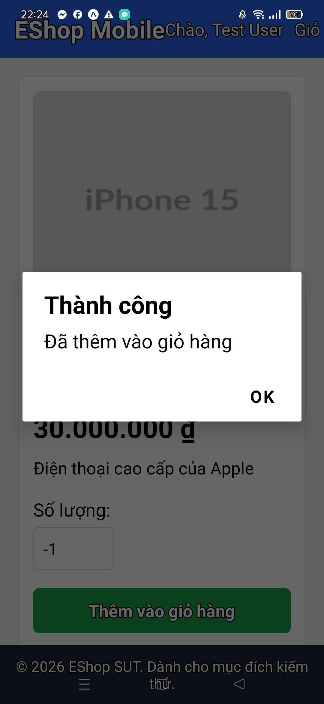
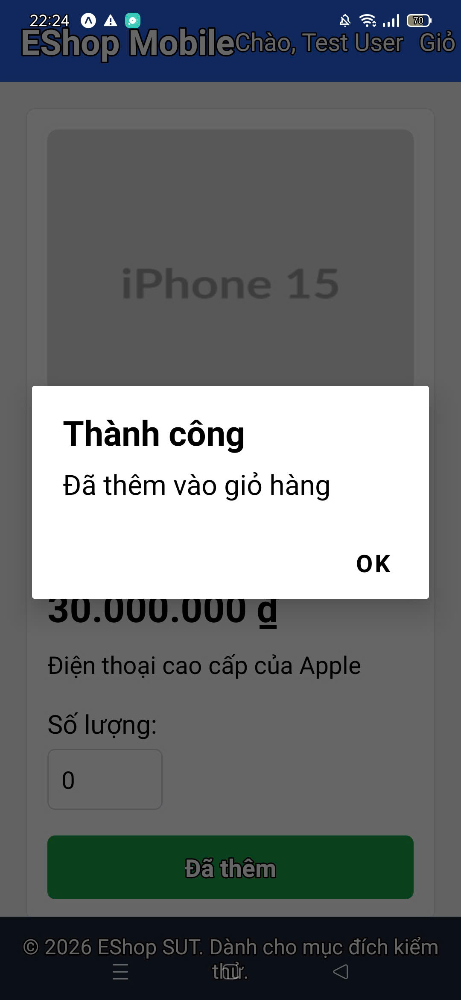
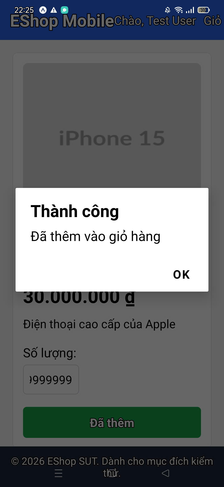

# BUG-003 - Mobile Product Detail Allows Invalid Quantities to Be Added to Cart

## Title

Product Detail page accepts invalid quantities such as `-1`, `0`, `1.5`, and very large values

## Environment

- Feature: FR-20 - Mobile App - Shopping Cart
- Client: React Native / Expo mobile app
- Backend: Node.js API
- Execution mode: Manual Expo emulator UI execution
- Test cases: `DT-TC033`, `DT-TC034`, `DT-TC035`, `DT-TC036`
- Boundary follow-up: `BVA-TC005`, `DT-TC040-to-DT-TC045-ui_cannot_break`
- Tester-provided finding: invalid Product Detail quantities were allowed

## Preconditions

- Expo emulator is running.
- User is logged in as a registered user.
- Product catalog contains `iPhone 15 Pro Max`.
- User opens the Product Detail page for `iPhone 15 Pro Max`.

## Steps to Reproduce

1. Open the mobile app in the Expo emulator.
2. Log in as a registered user.
3. Open a product detail page.
4. In the `Số lượng` field, enter `-1`.
5. Tap `Thêm vào giỏ hàng`.
6. Repeat with `0`, `1.5`, and a very large value such as `999999999`.

## Expected Result

The app should reject invalid quantities before adding to cart.

Expected behavior:

- `-1` should not be accepted.
- `0` should not be accepted.
- Decimal quantity such as `1.5` should be rejected or normalized consistently before adding.
- Extremely large quantity should be constrained or rejected.
- No success alert should be shown for invalid quantity.

## Actual Result

The UI allowed invalid quantities and showed a success alert:

```text
Thành công
Đã thêm vào giỏ hàng
```

Manual findings provided by the tester:

- Negative quantity `-1` was allowed.
- Zero quantity `0` was allowed.
- Decimal quantity `1.5` was allowed.
- Large quantity `999999999` was allowed.

Boundary follow-up:

- `BVA-TC005` confirmed the API accepted `quantity: 0`.
- The manual UI screenshots confirm the Product Detail input accepted the same invalid quantity family.

## Severity

High

## Impact

Users can add invalid quantities from the mobile Product Detail page. This can produce invalid cart state, incorrect totals, and potentially unusable checkout values.

## Screenshots

Negative quantity accepted:



Zero quantity accepted:



Decimal quantity accepted:


Large quantity accepted:


