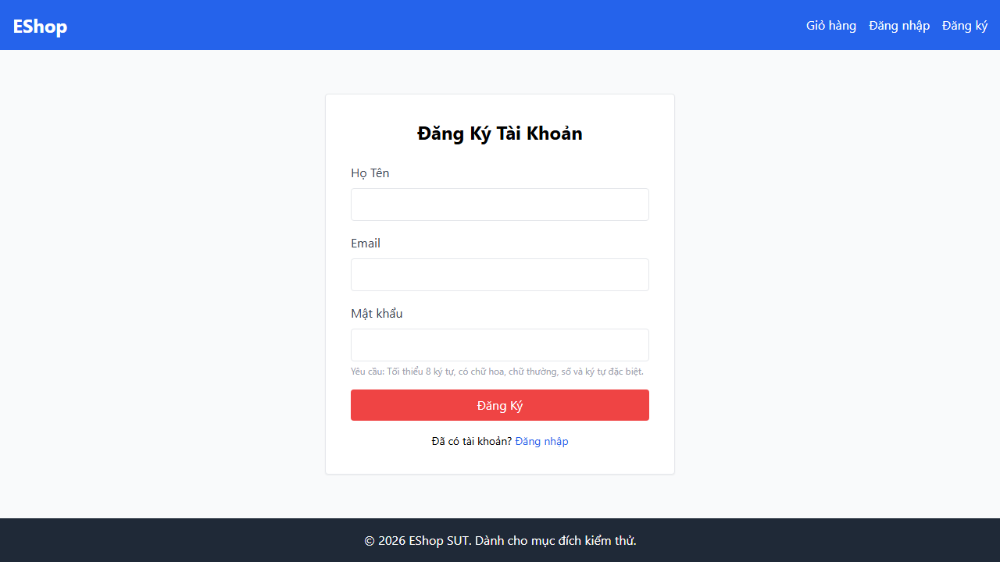

# DT-01 — Feature Understanding
**Feature:** FR-01 — Account Registration  
**Date:** 2026-07-07  
**Skill:** DT-01  
**Evidence:** `tests/FR01/screenshots/ENV-register-page.png`

---

## 1. Feature Summary

The **Account Registration** feature allows a Guest (unauthenticated) user to create a new account on the EShop platform by submitting their full name, email address, and password through the `/register` page. Upon successful submission, the backend creates the account and returns a confirmation message.

---

## 2. Actors

| Actor | Role |
|-------|------|
| Guest | Primary actor. Unauthenticated user who wants to create a new account. |
| Backend API | Receives the registration request and creates the user record. |

---

## 3. System Inputs

Observed directly from the UI screenshot (`ENV-register-page.png`):

| Input ID | UI Label | Variable | Data Type | Required | Notes |
|----------|----------|----------|-----------|----------|-------|
| FI-01 | Họ Tên | `name` | String | Yes | Free-text full name field |
| FI-02 | Email | `email` | String (Email format) | Yes | Used as account identifier |
| FI-03 | Mật khẩu | `password` | Password String | Yes | Validation hint visible in UI: *"Yêu cầu: Tối thiểu 8 ký tự, có chữ hoa, chữ thường, số và ký tự đặc biệt."* |
| FI-04 | Đăng Ký | `registerButton` | Button | N/A | Submits the registration form |

---

## 4. System Outputs

| Outcome | Trigger | Observable Behaviour |
|---------|---------|----------------------|
| Success | All inputs valid, email not already registered | API returns `{"message": "User registered successfully", "id": <id>}` (per api_specification.md §1.1). UI behaviour after success: **Not specified** — not observable without execution. |
| Failure | Invalid input or duplicate email | Error response from API. UI error display behaviour: **Not specified without execution.** |

---

## 5. Business Rules

Derived from UI evidence and api_specification.md only:

| Rule ID | Business Rule | Evidence Source |
|---------|--------------|-----------------|
| BR-01 | `name` is required | UI field is mandatory (inferred from required status in WORKFLOW feature inputs) |
| BR-02 | `email` must be in valid email format | UI field type and standard registration convention; label in UI is orange indicating required |
| BR-03 | `password` must be ≥ 8 characters | Password requirement text visible in UI |
| BR-04 | `password` must contain uppercase letter | Password requirement text visible in UI |
| BR-05 | `password` must contain lowercase letter | Password requirement text visible in UI |
| BR-06 | `password` must contain a digit | Password requirement text visible in UI |
| BR-07 | `password` must contain a special character | Password requirement text visible in UI |
| BR-08 | API endpoint is `POST /api/register` | api_specification.md §1.1 |
| BR-09 | Successful response returns HTTP 200 with `{"message": "User registered successfully", "id": <n>}` | api_specification.md §1.1 |

---

## 6. Preconditions

- User is not authenticated (Guest).
- User has navigated to `/register`.
- Backend service is reachable at `http://localhost:3000`.
- Frontend is loaded at `http://localhost:5173`.

---

## 7. Assumptions

| # | Assumption | Status |
|---|-----------|--------|
| A-01 | All three text fields (`name`, `email`, `password`) are required — submitting with any blank field triggers an error | **Assumption** — exact client-side vs. server-side validation behaviour not yet confirmed without execution |
| A-02 | Registering with a duplicate email is rejected | **Assumption** — not directly visible in UI; stated as standard behaviour. Needs execution evidence. |
| A-03 | There is no maximum length enforced on `name` beyond what the browser/server imposes | **Not specified** — no UI hint visible |
| A-04 | `email` must be globally unique in the system | **Assumption** — standard behaviour; needs verification |

---

## 8. Open Questions

| # | Question | Impact |
|---|---------|--------|
| OQ-01 | What is the maximum length for `name`? | Affects BVA test cases |
| OQ-02 | What is the maximum length for `email`? | Affects BVA test cases |
| OQ-03 | What is the maximum length for `password`? | Affects BVA test cases |
| OQ-04 | Does the UI show a specific error message for each validation failure, or a generic one? | Affects expected results in test cases |
| OQ-05 | What happens to the UI after successful registration — redirect, toast, modal? | Affects expected results |
| OQ-06 | Is there any rate-limiting or CAPTCHA on the registration endpoint? | Affects test execution approach |

---

## 9. Human Review Checklist

- [x] Feature purpose is correct
- [x] All actors identified
- [x] All business rules have evidence
- [x] No unsupported assumptions — ask for clarification on OQ-01 through OQ-06 if needed

---

## Screenshot Evidence

